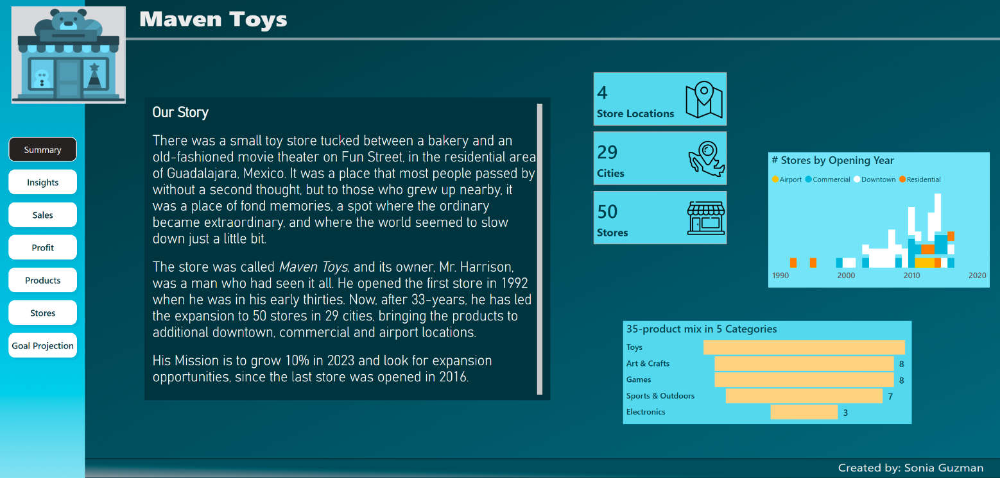

# Maven_Toys

## 🛠️ Skills

This report is designed to demonstrate skills in:
- Data preparation in CSV files (data from Maven Analytics)
- Data normalization to create fact and dimension tables
- Data modeling and analysis
- Data visualization and storytelling in Power BI
- Creating interactive, professional dashboards
- Transforming complex data into actionable insights 

### 🎯 Background
This report analyzes 2023 sales performance for the fictional company Maven Toys, operating 50 stores across 29 Mexican cities. It reviews financial
results, product and store performance, and assesses whether the 10% annual sales growth target is achievable.

### 🚀 Insights and Recommendations
This report analyzes 2023 sales performance for the fictional company **Maven Toys**, operating 50 stores across 29 Mexican cities.  
It reviews financial results, product and store performance, and assesses whether the 10% annual sales growth target is achievable.

---

## 📊 Key Findings

- **YTD Revenue**: $6.96M (up 30.9% YoY). To reach the $9.27M goal, 24.9% more revenue is needed by year-end.
- **Best Category**: Toys – $2.3M (33% of total).
- **Fastest Growth**: Arts & Crafts – up 251.9%, led by Magic Sand (+24,825%).
- **Underperforming**: Electronics – down 27.8%, due to falling Colorbuds sales, despite its high profit margin (53.4%).
- **Barrel of Slime** leads in unit sales; **Lego** leads in revenue but has a low margin (12.5%).
- **Jenga** has the highest margin (70%) but low revenue contribution.
- **Classic Dominoes** is the least profitable product.
- At the current pace ($25.5K/day in September), Maven Toys is on track to exceed its annual target, especially with expected holiday sales.

---

## 🏬 Store Performance

- **Downtown Stores**: $3.99M YTD (57% of total), up 33.4%.
- **Airports**: Strong growth (+33.4%), led by Mexico City, but contribute only 9.2% of revenue.
- **No new stores since 2016.** Airport expansion could drive growth.

---

## ✅ Recommendations

- Explore airport retail expansion.
- Investigate pricing and demand trends for Colorbuds.
- Consider improving margins on high-revenue items like Lego.
- Prioritize restocking fast-selling items.
- Analyze at least 10 years of sales data to inform strategy.

👉 [**Read insights in this full infographic version in PDF**](./Maven_Toys.pdf)

